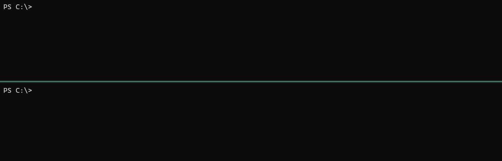

# ⛵ dotnet-sail
Run .NET project source code hosted on Gist, GitHub, Git or the web directly in a container easily and instantly. No CI or container registry required.

This container image performs **Download** (`git clone` or HTTP), **Build** (`dotnet build`), and **Run** (`dotnet run`) all at once, simply by specifying the source code address.

> [!IMPORTANT]
> dotnet-sail is primarily intended for temporary execution such as development, validation, and running sample code, and is not meant for use in production environments or the inner loop of day-to-day development.


## Example: Run ASP.NET Core app from Gist
```
docker run --rm -it -p 8080:8080 mayuki/dotnet-sail https://gist.github.com/mayuki/6779e703c81333457aef4a3271d6d5c5
```



## Example: Run [Blazor sample app (dotnet/blazor-samples)](https://github.com/dotnet/blazor-samples/)
```
docker run --rm -it -p 8080:8080 mayuki/dotnet-sail -r publish https://github.com/dotnet/blazor-samples/tree/main/8.0/BlazorSample_BlazorWebApp
```

> [!NOTE]
> To run a Blazor app, `publish` mode or `DOTNET_URLS` environment variable must be specified.

## How to use
The container images are available from the following container registries:

- mayuki/dotnet-sail (Docker Hub)
- ghcr.io/mayuki/dotnet-sail (GitHub Packages Container Registry)

### Run from Gist
```
docker run --rm -it ghcr.io/mayuki/dotnet-sail https://gist.github.com/mayuki/d052d7457a63f25763ce8ecf04b1d0fc
```

If the Gist contains only one C# file, it automatically generates a C# project and starts it. If the Gist includes a .csproj file, it uses that to start the project.

### Run from GitHub
```
docker run --rm -it -p 8080:8080 -e DOTNET_SAIL_ENV_DOTNET_ENVIRONMENT=Development dotnet-sail https://github.com/dotnet/blazor-samples/tree/main/8.0/BlazorSample_BlazorWebApp
```

#### Allowed URL forms
- `https://github.com/<org>/<repo>`
- `https://github.com/<org>/<repo>/tree/<branch-or-hash>/<path-to-source-directory>`
- `https://github.com/<org>/<repo>/blob/<branch-or-hash>/<path-to-source-directory>/<target>.csproj`


### Run from Git
```
# Git: https://github.com/dotnet/blazor-samples.git
# Branch: main
# Path: 8.0/BlazorSample_BlazorWebApp

docker run --rm -it -p 8080:8080 -e DOTNET_SAIL_ENV_DOTNET_ENVIRONMENT=Development dotnet-sail https://github.com/dotnet/blazor-samples.git?path=main/8.0/BlazorSample_BlazorWebApp&branch=main
```

#### Options
- `path`: The path of the directory or file that includes projects and sources within the repository.
- `branch`: The branch to checkout when cloning the repository.

## What does this do to help?

- Running temporary verification project
- Running samples or demonstration applications
- Hosting in environments where images can be easily run like Azure Container Instance, Container Apps, or Google Cloud Run

Typically, to run applications in container execution environments, you need to build for deployment, store build artifacts (container images), and set up secrets to make them deployable.

However, such settings are annoying when building a temporary environment for development, verification, or demonstration application. This container image realizes the developer's need to "I just want to run the source code that is here now."

## What is this not intended for?

- Use in production environments
- Use as a day-to-day development environment

The container image is **very large** because it includes the .NET SDKs, and in addition, it requires time to fetch the source code and build it each time it starts up. This overhead becomes non-negligible for regular usage. For general development purposes, it is recommended to set up a CI/CD mechanism.

Also, at this point, there is no provided method for configuring authentication when fetching source code.

## Command line options and environment variables
|Environemnt variable|Command option|Description|
|--|--|--|
|DOTNET_SAIL_SOURCE|`-s`, `--source`|Gist, GitHub, or any other address that provides source code. (https://, git://...) Can be used instead of passing it as an argument.|
|DOTNET_SAIL_ARGUMENTS||The arguments to be passed to the application.|
|DOTNET_SAIL_VERBOSITY|`-v`, `--verbosity`|Set the verbosity level. The default is 'Information'. Allowed values are `None`, `Error`, `Information` and `Trace`.|
|DOTNET_SAIL_RUNNER|`-r`, `--runner`|The strategy to run for. The default is 'DotNetRunRunner'. <br>Available runners are: <br><ul><li>`DotNetRunRunner`, `run`: Use 'dotnet build' and 'dotnet run'</li><li>`DotNetPublishAndExecRunner`, `publish`: Use 'dotnet publish' and 'dotnet exec'.</li></ul>|
|DOTNET_SAIL_CONFIGURATION|`-c`, `--configuration`|The configuration to run for.|
|DOTNET_SAIL_LAUNCH_PROFILE|`--launch-profile`|The name of the launch profile to use when launching the application. This option is available with 'dotnet run' (DotNetRunRunner).|
|DOTNET_SAIL_NO_LAUNCH_PROFILE|`--no-launch-profile`|Do not attempt to use launchSettings.json to configure the application. This option is available with 'dotnet run' (DotNetRunRunner).|
|DOTNET_SAIL_EXEC_NAME|`--exec-name`|The name of the entrypoint assembly. This option is available with 'dotnet publish' and 'dotnet exec' (DotNetPublishAndExecRunner).|
|DOTNET_SAIL_SDK|`--sdk`|The SDK to run for single C# source project. The default is 'Microsoft.NET.Sdk'.|
|DOTNET_SAIL_TARGET_FRAMEWORK|`--target-framework`|The target framework to run for single C# source project. The default is 'net8.0'.|
|DOTNET_SAIL_ENV_*|`-e`, `--env`|The environment variables for the application to be run.|

```
docker run --rm -it dotnet-sail -e DOTNET_ENVIRONMENT=Production https://example.com/repo.git arg1 arg2
```

It is also possible to pass settings through environment variables of the container.
```
docker run --rm -it -e DOTNET_SAIL_ENV_DOTNET_ENVIRONMENT=Production -e DOTNET_SAIL_SOURCE=https://example.com/repo.git dotnet-sail
```

## License
MIT License
